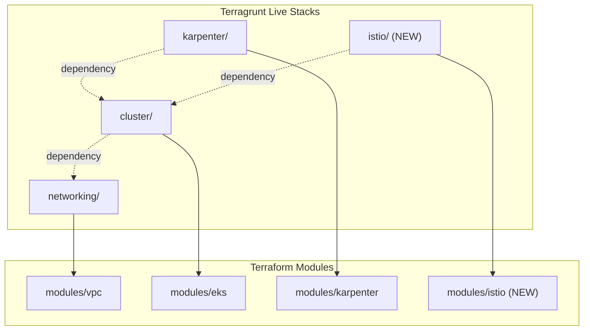
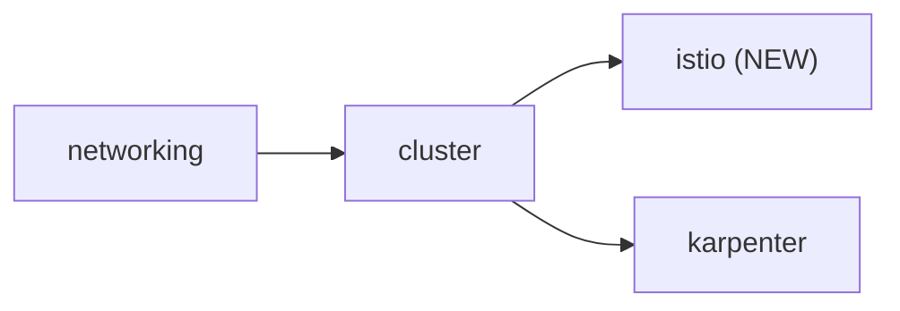

# EKS Istio Configuration

## Important Note

Istio is **not** available as a native AWS-managed EKS add-on (unlike vpc-cni, coredns, etc.). It must be installed via Helm charts from `https://istio-release.storage.googleapis.com/charts`. The plan uses `helm_release` resources -- the same approach your Karpenter module already uses.

## Architecture




## What Gets Created

### 1. New Terraform module: `modules/istio/`

Four files following the existing module pattern:

**[modules/istio/main.tf](aws/kubernetes/modules/istio/main.tf)** -- Core resources:

- **Security group rules** on the cluster SG to allow ports 15017 (sidecar injector webhook) and 15012 (xDS/Istiod-to-proxy) from control plane to nodes
- `**helm_release.istio_base`** -- Installs Istio CRDs (`base` chart) into `istio-system`
- `**helm_release.istiod`** -- Installs Istiod control plane (`istiod` chart) into `istio-system`, with configurable `meshConfig` (access logging, mTLS mode, tracing)
- `**helm_release.istio_ingress**` -- Installs ingress gateway (`gateway` chart) into `istio-ingress` namespace, with AWS NLB annotations (external, ip-mode, internet-facing)
- `**helm_release.istio_egress**` -- Installs egress gateway (`gateway` chart) into `istio-egress` namespace, as a ClusterIP service (no LB)
- Proper `depends_on` chain: base -> istiod -> gateways

Key Helm values for ingress gateway NLB:

```hcl
service.annotations."service.beta.kubernetes.io/aws-load-balancer-type"            = "external"
service.annotations."service.beta.kubernetes.io/aws-load-balancer-nlb-target-type" = "ip"
service.annotations."service.beta.kubernetes.io/aws-load-balancer-scheme"          = "internet-facing"
```

**[modules/istio/variables.tf](aws/kubernetes/modules/istio/variables.tf)** -- Input variables:

- `cluster_name`, `environment` -- standard
- `cluster_security_group_id`, `cluster_primary_security_group_id` -- for SG rules
- `istio_version` (default: `"1.26.0"`)
- `enable_ingress_gateway` (default: `true`), `ingress_gateway_lb_scheme` (default: `"internet-facing"`)
- `enable_egress_gateway` (default: `true`)
- `mesh_config` -- map for mTLS mode, access log, tracing settings

**[modules/istio/outputs.tf](aws/kubernetes/modules/istio/outputs.tf)** -- Outputs:

- `istiod_version`, `ingress_gateway_namespace`, `egress_gateway_namespace`

**[modules/istio/versions.tf](aws/kubernetes/modules/istio/versions.tf)** -- Provider requirements:

- `hashicorp/aws ~> 5.0`, `hashicorp/helm ~> 2.0` (same as Karpenter, minus `kubectl` since no CRD manifests needed)

### 2. New Terragrunt live stacks: `live/eu-west-1/{dev,stage,prod}/istio/terragrunt.hcl`

Following the exact pattern from [karpenter/terragrunt.hcl](aws/kubernetes/live/eu-west-1/dev/karpenter/terragrunt.hcl):

- `include "root"` pointing to root `terragrunt.hcl`
- `dependency "cluster"` with mock outputs for validate/plan
- `generate "k8s_providers"` block generating Helm provider with exec-based auth (identical to Karpenter's)
- `terraform.source = "../../../../modules/istio"`
- `inputs` block wiring cluster outputs to module variables

Per-environment configuration differences:

- **dev**: `istio_version = "1.26.0"`, ingress scheme `"internet-facing"`, egress enabled
- **stage/prod**: Same structure, copied from dev (user can customize later)

### 3. Security group rules for Istio

Added to `modules/istio/main.tf` (not `modules/eks`) to keep Istio self-contained:

```hcl
resource "aws_security_group_rule" "istio_webhook" {
  description              = "Istio sidecar injector webhook"
  type                     = "ingress"
  from_port                = 15017
  to_port                  = 15017
  protocol                 = "tcp"
  source_security_group_id = var.cluster_primary_security_group_id
  security_group_id        = var.cluster_security_group_id
}

resource "aws_security_group_rule" "istio_xds" {
  description              = "Istiod xDS and CA"
  type                     = "ingress"
  from_port                = 15012
  to_port                  = 15012
  protocol                 = "tcp"
  source_security_group_id = var.cluster_primary_security_group_id
  security_group_id        = var.cluster_security_group_id
}
```

These allow the EKS control plane (API server) to reach Istiod's webhook (port 15017) and the xDS/CA endpoint (port 15012) on worker nodes.

### 4. EKS module output addition

Add `cluster_security_group_id` to the dependency mock outputs in the Istio Terragrunt file (this output already exists in [modules/eks/outputs.tf](aws/kubernetes/modules/eks/outputs.tf) line 27).

## Dependency Flow




## Files to Create


| File                                                       | Purpose                    |
| ---------------------------------------------------------- | -------------------------- |
| `aws/kubernetes/modules/istio/main.tf`                     | SG rules + 4 Helm releases |
| `aws/kubernetes/modules/istio/variables.tf`                | Input variables            |
| `aws/kubernetes/modules/istio/outputs.tf`                  | Outputs                    |
| `aws/kubernetes/modules/istio/versions.tf`                 | Provider constraints       |
| `aws/kubernetes/live/eu-west-1/dev/istio/terragrunt.hcl`   | Dev stack                  |
| `aws/kubernetes/live/eu-west-1/stage/istio/terragrunt.hcl` | Stage stack                |
| `aws/kubernetes/live/eu-west-1/prod/istio/terragrunt.hcl`  | Prod stack                 |


No existing files need modification.

## Deployment Order

After `terragrunt apply`:

1. SG rules are created
2. `istio-base` Helm release (CRDs)
3. `istiod` Helm release (control plane)
4. `istio-ingress` gateway (NLB provisioned)
5. `istio-egress` gateway (ClusterIP)

## Post-Deployment

To enable sidecar injection on a namespace:

```bash
kubectl label namespace <name> istio-injection=enabled
```

