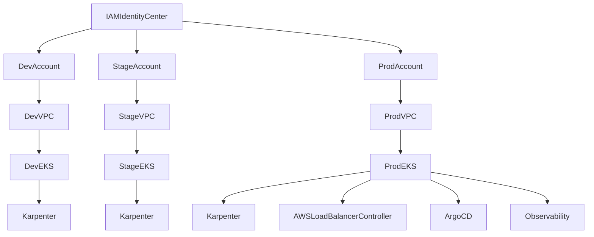

## Goals

- Production-grade EKS in `eu-west-1` with **Karpenter** for node provisioning/autoscaling.
- **Multi-account, multi-env**: separate AWS accounts for `dev`, `stage`, `prod` (plus optional `shared`/`security` later).
- **Everything via IaC**: reusable Terraform modules + Terragrunt “live” stacks.
- A learning-friendly delivery: minimal baseline first, then platform add-ons.

## High-level architecture

## Design defaults (sane production baseline)

- **Networking**: 3 AZs, private subnets for nodes, public subnets only for ALBs/NLBs; NAT per AZ.
- **Cluster endpoint**: private (preferred) with controlled access (VPN/SSM/bastion) or public with strict CIDRs.
- **Encryption**: EKS secrets encryption with KMS CMK; EBS default encryption.
- **AuthN/AuthZ**: IAM Identity Center + AWS-auth mapping (or EKS access entries) + RBAC roles.
- **Workload identity**: IRSA everywhere (Karpenter, ALB controller, external-dns, cert-manager, observability).
- **Add-ons**: EKS managed add-ons where possible (CoreDNS, kube-proxy, VPC CNI, EBS CSI).
- **Karpenter**: NodePools split by purpose (general/spot/system), consolidation enabled, interruption handling (SQS).

## Repository layout (Terraform modules + Terragrunt live)

- **Modules** (reusable):
  - `[infrastructure/modules/vpc]` (VPC, subnets, NAT, endpoints)
  - `[infrastructure/modules/eks]` (EKS cluster, OIDC, KMS, cluster logging)
  - `[infrastructure/modules/eks-addons]` (EKS managed add-ons + Helm releases)
  - `[infrastructure/modules/karpenter]` (IRSA, SQS, instance profile/role, Helm install)
  - `[infrastructure/modules/observability]` (Prometheus/Grafana + logging integration)
- **Live stacks** (per account/env/region):
  - `[infrastructure/live/eu-west-1/dev/*]`
  - `[infrastructure/live/eu-west-1/stage/*]`
  - `[infrastructure/live/eu-west-1/prod/*]`
- Terragrunt conventions:
  - root `terragrunt.hcl` with remote state, providers, common tags.
  - `env.hcl` for account/env-specific values.
  - strict dependency graph: `vpc -> eks -> addons -> karpenter -> apps`.

## Phase 0 — Account + foundational AWS setup (minimal, but correct)

- Create/confirm:
  - AWS Organizations structure (dev/stage/prod accounts).
  - SSO/IAM Identity Center, permission sets, break-glass role.
  - Centralized state: S3 + DynamoDB locks per env (or per org).
  - Baseline security controls: CloudTrail, Config (at least in prod), guardrails/SCPs (deny risky APIs, restrict regions to `eu-west-1`).
- Outputs:
  - Standard tagging, naming conventions, account IDs, DNS ownership plan.

## Phase 1 — Networking (greenfield)

- Build VPC per env (dev/stage/prod) via `[infrastructure/modules/vpc]`:
  - 3 AZ private/public subnets.
  - NAT gateways (per AZ for prod).
  - VPC endpoints (S3, ECR, STS, CloudWatch, EC2) to reduce egress and improve security.
- Decide connectivity for private endpoint access:
  - SSM Session Manager to admin nodes/pods (preferred) and/or VPN.

## Phase 2 — EKS cluster baseline (minimal but production-ready)

- Create EKS per env via `[infrastructure/modules/eks]`:
  - Private cluster endpoint default (or tightly restricted public CIDRs).
  - Control-plane logging enabled.
  - KMS secrets encryption.
  - OIDC provider for IRSA.
- Node strategy (initial minimal):
  - Small managed node group for system pods + bootstrap (so Karpenter can come up safely).
  - Taints/labels to keep workloads off system group once Karpenter is live.

## Phase 3 — Karpenter (core objective)

- Install Karpenter via `[infrastructure/modules/karpenter]`:
  - IRSA role + controller permissions.
  - Interruption handling: SQS queue + EventBridge rules.
  - Default NodeClass/NodePool (example patterns):
    - `generalOnDemand` (safe baseline)
    - `generalSpot` (cost-optimized, disruption-aware)
    - `system` (optional, for dedicated system capacity)
  - Constraints: instance families, arch, zones, capacity type, max price (optional), consolidation.
- Validation:
  - Run a controlled scale test (deployment replicas) and confirm nodes are provisioned/terminated as expected.

## Phase 4 — Platform add-ons (your requested components, after baseline is stable)

- GitOps (recommended Argo CD) in `[infrastructure/modules/eks-addons]`:
  - Argo CD via Helm, IRSA if needed for AWS integrations.
  - App-of-apps pattern per env.
- Ingress (AWS Load Balancer Controller):
  - Install via Helm, IRSA.
  - Standard IngressClass + annotations policy.
- cert-manager:
  - Install via Helm.
  - DNS01 using Route53 (recommended) with IRSA.
- Observability baseline:
  - Metrics: kube-prometheus-stack (Prometheus/Grafana/Alertmanager).
  - Logs: choose one path (CloudWatch agent/Fluent Bit to CloudWatch) initially.
  - Minimal alerts: node not ready, pod crashloop, Karpenter provisioning failures.
- Security baseline:
  - Namespace standards, RBAC, least-privilege IRSA policies.
  - Pod Security Standards (enforce baseline/restricted where possible).
  - Network policy approach: start with Calico for NetworkPolicies if required (keep CNI as AWS VPC CNI initially).

## Phase 5 — Production hardening + operations

- Reliability:
  - Define SLOs, alerting thresholds, on-call runbooks.
  - PodDisruptionBudgets and topology spread constraints for critical workloads.
- Scaling/cost controls:
  - Karpenter consolidation settings; spot diversification.
  - Cluster autoscaling guardrails (max nodes, node TTL where appropriate).
  - Budget alarms per account/env.
- Backup/DR (optional next):
  - Velero + EBS snapshots; restore drills.
- Security reviews:
  - IAM policy review; IRSA policy tightening.
  - Image provenance (ECR scanning), admission controls (later: Kyverno/Gatekeeper).

## Learning track (hands-on)

- Learn basics by doing, aligned to the build:
  - Kubernetes fundamentals: namespaces, deployments, services, ingress, RBAC, storage.
  - EKS specifics: VPC CNI, IRSA, managed add-ons, node security groups.
  - Karpenter specifics: NodePool/NodeClass, consolidation, disruption, spot behavior.
- Practical exercises per phase:
  - Phase 2: deploy a simple app + HPA.
  - Phase 3: induce scale-up/down and validate Karpenter behavior.
  - Phase 4: create ingress + TLS via cert-manager.

## Acceptance criteria (how we know it’s “production grade”)

- Reproducible from scratch via Terragrunt.
- Private networking posture is enforced (or public is tightly controlled).
- IRSA used for controllers; no static AWS creds in cluster.
- Karpenter provisions nodes on demand, consolidates safely, and handles interruptions.
- GitOps drives app state; ingress + TLS automated; basic monitoring/alerting in place.

