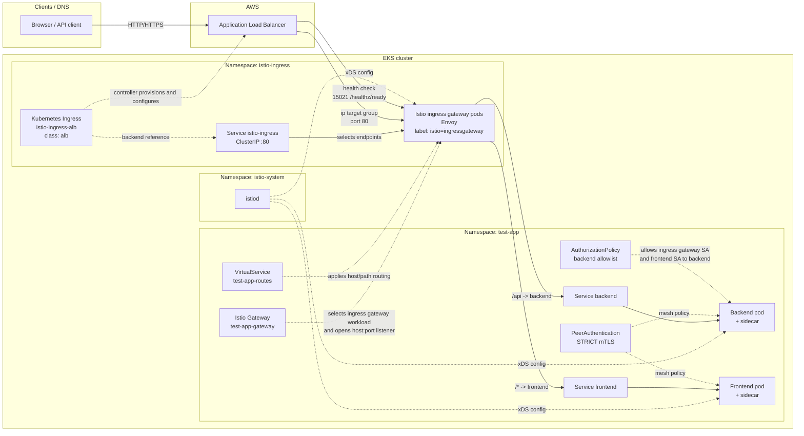

# Istio ingress traffic flow (this repository)

## Overview

This repository uses **AWS ALB + Kubernetes Ingress** for the external entry point and **Istio Gateway + VirtualService** for in-mesh routing.

The important detail is:

1. The Kubernetes `Ingress` object is consumed by the **AWS Load Balancer Controller** to create and configure the **ALB**.
2. The `Ingress` backend points to the `istio-ingress` **Service**.
3. Because the ALB annotation sets `alb.ingress.kubernetes.io/target-type: ip`, the ALB forwards traffic to **Istio ingress gateway pod IPs**, not to the ClusterIP itself.
4. Those gateway Envoy pods then apply **Istio `Gateway`** and **`VirtualService`** configuration and route traffic to the application Services.

## Infrastructure diagram

## Request path

1. A client resolves DNS to the **ALB** created from `kubernetes_ingress_v1.istio_alb`.
2. The **AWS Load Balancer Controller** reads that `Ingress` and uses the backend `Service` named `istio-ingress` on port `80`.
3. Because the ALB uses **IP mode** (`alb.ingress.kubernetes.io/target-type = "ip"`), it sends requests to the **Istio ingress gateway pod IPs**.
4. The gateway Envoy accepts traffic only for the hosts and ports defined in the Istio **`Gateway`** resource, such as `test-app-gateway`.
5. The Istio **`VirtualService`** applies host/path rules:
   - `/api` is rewritten and sent to `backend.<namespace>.svc.cluster.local`
   - everything else is sent to `frontend.<namespace>.svc.cluster.local`
6. In the `test-app` namespace, pods run with **Istio sidecars** because the namespace is labeled with `istio-injection=enabled`.
7. East-west traffic inside that namespace is protected by **STRICT mTLS**, and backend access is constrained by the **AuthorizationPolicy**.

## Browser-to-response sequence

### Request to `/`

1. A browser sends an HTTP request to the DNS name that points to the **Application Load Balancer** created from Kubernetes `Ingress` **`istio-ingress-alb`**.
2. The **AWS Load Balancer Controller** has already configured that ALB from `kubernetes_ingress_v1.istio_alb`, using backend Service **`istio-ingress`** on port `80`.
3. Because the ALB uses `alb.ingress.kubernetes.io/target-type = "ip"`, the request is forwarded directly to one of the **Istio ingress gateway pods** deployed by Helm release **`istio-ingress`** in namespace **`istio-ingress`**.
4. The gateway Envoy checks the Istio `Gateway` resource **`test-app-gateway`** in namespace **`test-app`**. That resource selects workloads with label `istio=ingressgateway` and accepts HTTP traffic on port `80`.
5. The same gateway Envoy then applies the Istio `VirtualService` **`test-app-routes`**.
6. Because the request path is `/`, the `frontend-default` route in **`test-app-routes`** sends traffic to Service **`frontend.test-app.svc.cluster.local`**.
7. Kubernetes Service **`frontend`** selects one of the **`frontend`** pods in namespace **`test-app`**.
8. The selected **`frontend`** pod serves the response from the NGINX container.
9. The response travels back through the same path in reverse: **`frontend` pod -> Istio ingress gateway pod -> ALB -> browser**.

### Request to `/api`

1. A browser sends a request for `/api` to the same ALB created from **`istio-ingress-alb`**.
2. The ALB forwards the request directly to an **Istio ingress gateway pod** behind Service **`istio-ingress`**.
3. The gateway Envoy matches the request against Istio `Gateway` **`test-app-gateway`**.
4. The gateway Envoy applies Istio `VirtualService` **`test-app-routes`**.
5. The `backend-api` route matches because the URI prefix is `/api`.
6. Istio rewrites the path from `/api` to `/`.
7. The request is routed to Service **`backend.test-app.svc.cluster.local`**.
8. Kubernetes Service **`backend`** selects one of the **`backend`** pods in namespace **`test-app`**.
9. The selected **`backend`** pod, running container **`backend`** from image `hashicorp/http-echo:0.2.3`, returns the configured message.
10. In `dev`, that response body is **`hello from backend`**.
11. The response returns on the reverse path: **`backend` pod -> Istio ingress gateway pod -> ALB -> browser**.

### When the frontend calls the backend

1. A browser first loads `/`, so traffic is routed to Service **`frontend`** and then to a **`frontend`** pod.
2. Inside the **`frontend`** pod, NGINX is configured by ConfigMap **`frontend-nginx-config`**.
3. That NGINX config contains `location /api` with `proxy_pass http://backend.test-app.svc.cluster.local;`.
4. If the frontend serves a request that triggers `/api`, the **`frontend`** pod sends an internal request to Service **`backend`**.
5. Because namespace **`test-app`** has `istio-injection=enabled`, this pod-to-pod traffic goes through the Istio sidecars.
6. Istio `PeerAuthentication` **`default`** enforces **STRICT mTLS** for traffic inside namespace **`test-app`**.
7. Istio `AuthorizationPolicy` **`backend-allow-frontend-only`** allows the backend to be reached by the application service account in **`test-app`** and by the ingress gateway service account in **`istio-ingress`**.
8. Service **`backend`** forwards the request to a **`backend`** pod, which returns the response.
9. The **`frontend`** pod receives that backend response and returns the final HTTP response to the browser through the ingress path.

## What carries traffic vs what configures traffic

The objects that actually carry request traffic are:

- **ALB**
- **Istio ingress gateway Envoy pods**
- **Kubernetes Services / pod endpoints**
- **Application pods and sidecars**

The objects that mostly provide configuration are:

- **Kubernetes `Ingress`**
- **Istio `Gateway`**
- **Istio `VirtualService`**
- **`PeerAuthentication`**
- **`AuthorizationPolicy`**
- **Istiod** (control plane config distribution)

## Components

| Component | Location | Purpose |
|-----------|----------|---------|
| `kubernetes_ingress_v1.istio_alb` | `istio-ingress` | Defines the ALB-facing ingress rule and points to Service `istio-ingress:80`. |
| Helm release `istio-ingress` | `istio-ingress` | Installs the Istio gateway workload and Service; the Service is `ClusterIP`. |
| Istio `Gateway` | App or Argo CD namespace | Selects `istio=ingressgateway` pods and defines listener host/port combinations. |
| `VirtualService` | Same namespace as the Istio `Gateway` | Defines host/path matching and destination Services. |
| `istiod` | `istio-system` | Pushes xDS config to the ingress gateway and sidecars. |
| Security group rules | AWS | Allow ALB data traffic on `80` and health checks on `15021` to reach gateway pods. |

## Naming note

- **Istio ingress gateway** = the deployed gateway workload and Service in `istio-ingress`.
- **Istio `Gateway`** = the CRD that configures listeners on that gateway workload.
- **Kubernetes `Ingress`** = the resource the AWS Load Balancer Controller uses to provision the ALB.

## References in repo

- `aws/kubernetes/modules/istio/main.tf` — Istiod, ingress gateway, ALB Ingress, and security group rules.
- `aws/kubernetes/modules/test-app/main.tf` — test-app namespace is labeled with `istio-injection=enabled`.
- `aws/kubernetes/modules/test-app/istio.tf` — `Gateway`, `VirtualService`, `DestinationRule`, `PeerAuthentication`, `AuthorizationPolicy`, and `ServiceEntry`.
- `aws/kubernetes/modules/argocd/main.tf` — optional Argo CD sidecar injection plus `Gateway` and `VirtualService` for Argo CD.

## Caveat

`eks_istio_configuration_plan.md` still mentions an NLB in places, but the implemented Terraform in `modules/istio/main.tf` uses **ALB + Kubernetes Ingress + ClusterIP gateway Service**.