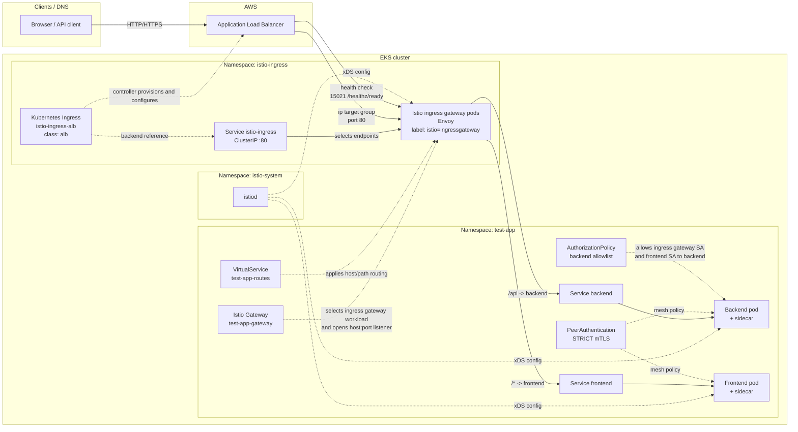

# Istio ingress traffic flow (this repository)

## Overview

This repository uses **AWS ALB + Kubernetes Ingress** for the external entry point and **Istio Gateway + VirtualService** for in-mesh routing.

The important detail is:

1. The Kubernetes `Ingress` object is consumed by the **AWS Load Balancer Controller** to create and configure the **ALB**.
2. The `Ingress` backend points to the `istio-ingress` **Service**.
3. Because the ALB annotation sets `alb.ingress.kubernetes.io/target-type: ip`, the ALB forwards traffic to **Istio ingress gateway pod IPs**, not to the ClusterIP itself.
4. Those gateway Envoy pods then apply **Istio `Gateway`** and **`VirtualService`** configuration and route traffic to the application Services.

## Infrastructure diagram

## Request path

1. A client resolves DNS to the **ALB** created from `kubernetes_ingress_v1.istio_alb`.
2. The **AWS Load Balancer Controller** reads that `Ingress` and uses the backend `Service` named `istio-ingress` on port `80`.
3. Because the ALB uses **IP mode** (`alb.ingress.kubernetes.io/target-type = "ip"`), it sends requests to the **Istio ingress gateway pod IPs**.
4. The gateway Envoy accepts traffic only for the hosts and ports defined in the Istio **`Gateway`** resource, such as `test-app-gateway`.
5. The Istio **`VirtualService`** applies host/path rules:
   - `/api` is rewritten and sent to `backend.<namespace>.svc.cluster.local`
   - everything else is sent to `frontend.<namespace>.svc.cluster.local`
6. In the `test-app` namespace, pods run with **Istio sidecars** because the namespace is labeled with `istio-injection=enabled`.
7. East-west traffic inside that namespace is protected by **STRICT mTLS**, and backend access is constrained by the **AuthorizationPolicy**.

## What carries traffic vs what configures traffic

The objects that actually carry request traffic are:

- **ALB**
- **Istio ingress gateway Envoy pods**
- **Kubernetes Services / pod endpoints**
- **Application pods and sidecars**

The objects that mostly provide configuration are:

- **Kubernetes `Ingress`**
- **Istio `Gateway`**
- **Istio `VirtualService`**
- **`PeerAuthentication`**
- **`AuthorizationPolicy`**
- **Istiod** (control plane config distribution)

## Components

| Component | Location | Purpose |
|-----------|----------|---------|
| `kubernetes_ingress_v1.istio_alb` | `istio-ingress` | Defines the ALB-facing ingress rule and points to Service `istio-ingress:80`. |
| Helm release `istio-ingress` | `istio-ingress` | Installs the Istio gateway workload and Service; the Service is `ClusterIP`. |
| Istio `Gateway` | App or Argo CD namespace | Selects `istio=ingressgateway` pods and defines listener host/port combinations. |
| `VirtualService` | Same namespace as the Istio `Gateway` | Defines host/path matching and destination Services. |
| `istiod` | `istio-system` | Pushes xDS config to the ingress gateway and sidecars. |
| Security group rules | AWS | Allow ALB data traffic on `80` and health checks on `15021` to reach gateway pods. |

## Naming note

- **Istio ingress gateway** = the deployed gateway workload and Service in `istio-ingress`.
- **Istio `Gateway`** = the CRD that configures listeners on that gateway workload.
- **Kubernetes `Ingress`** = the resource the AWS Load Balancer Controller uses to provision the ALB.

## References in repo

- `aws/kubernetes/modules/istio/main.tf` — Istiod, ingress gateway, ALB Ingress, and security group rules.
- `aws/kubernetes/modules/test-app/main.tf` — test-app namespace is labeled with `istio-injection=enabled`.
- `aws/kubernetes/modules/test-app/istio.tf` — `Gateway`, `VirtualService`, `DestinationRule`, `PeerAuthentication`, `AuthorizationPolicy`, and `ServiceEntry`.
- `aws/kubernetes/modules/argocd/main.tf` — optional Argo CD sidecar injection plus `Gateway` and `VirtualService` for Argo CD.

## Caveat

`eks_istio_configuration_plan.md` still mentions an NLB in places, but the implemented Terraform in `modules/istio/main.tf` uses **ALB + Kubernetes Ingress + ClusterIP gateway Service**.