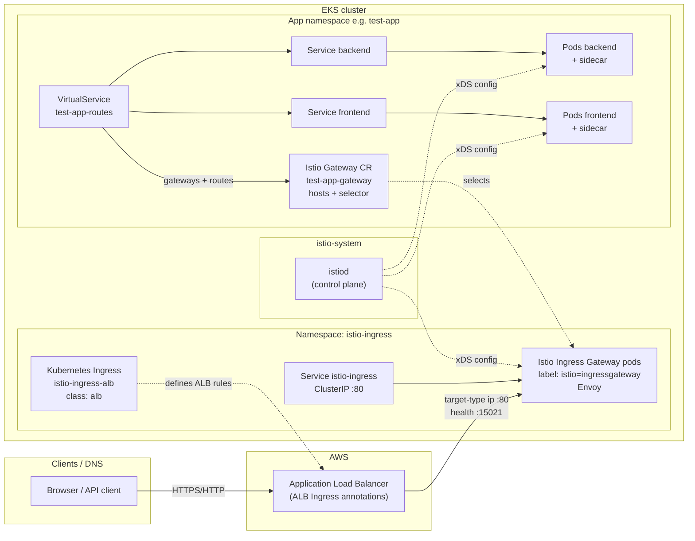

# Istio ingress traffic flow (this repository)

## Overview

External traffic reaches workloads through **two different “ingress” concepts** that work together:

1. **Kubernetes Ingress + AWS ALB** — AWS-facing load balancing and TLS termination (optional), managed by the **AWS Load Balancer Controller** using `ingress_class_name: alb`.
2. **Istio Ingress Gateway + Gateway/VirtualService** — In-cluster **Envoy** (the Istio “ingress gateway” deployment) performs host/path routing defined by Istio CRDs.

The Istio ingress gateway Service is **ClusterIP**, not a public LoadBalancer: the **ALB sends traffic directly to gateway pod IPs** (`alb.ingress.kubernetes.io/target-type: ip`).

## Components

| Component | Location | Purpose |
|-----------|----------|---------|
| `kubernetes_ingress_v1.istio_alb` | `istio-ingress` | Binds ALB to Service `istio-ingress:80`. |
| Helm release `istio-ingress` | `istio-ingress` | Installs Istio’s `gateway` chart; pods labeled `istio: ingressgateway`. |
| `Gateway` (Istio) | App/Argo CD namespace | Selects ingress gateway workloads; defines `hosts` and listener port (e.g. 80). |
| `VirtualService` | Same namespace as `Gateway` | Routes `hosts` + paths to Kubernetes `Service` names and ports. |
| `istiod` | `istio-system` | Control plane; configures all Envoys. |
| Security groups | AWS | Allow ALB → gateway pods on 80 and health checks on 15021 (see `modules/istio/main.tf`). |

## Request path (north–south)

1. DNS points to the **ALB** (from the Ingress status after apply).
2. **ALB** forwards HTTP(S) to **ingress gateway pod IPs** on port 80.
3. Gateway Envoy matches the **Istio `Gateway`** (host/port) and applies **`VirtualService`** rules.
4. Traffic is forwarded to **Kubernetes Services**; if the namespace uses Istio injection, **sidecar Envoys** handle mesh features (mTLS, policies, etc.).

## Naming note

- **“Ingress Gateway”** in Istio = the **gateway workload** (Envoy) + Service in `istio-ingress`.
- **“Gateway”** in Kubernetes = the **`Ingress` API object** that triggers the **ALB** here — do not confuse it with Istio’s **`Gateway` CR**.

## References in repo

- `aws/kubernetes/modules/istio/main.tf` — ALB Ingress, Helm gateway, istiod, SG rules.
- `aws/kubernetes/modules/test-app/istio.tf` — Example `Gateway`, `VirtualService`, policies.
- `aws/kubernetes/modules/argocd/main.tf` — Argo CD `Gateway` + `VirtualService` when `enable_istio_ingress` is true.